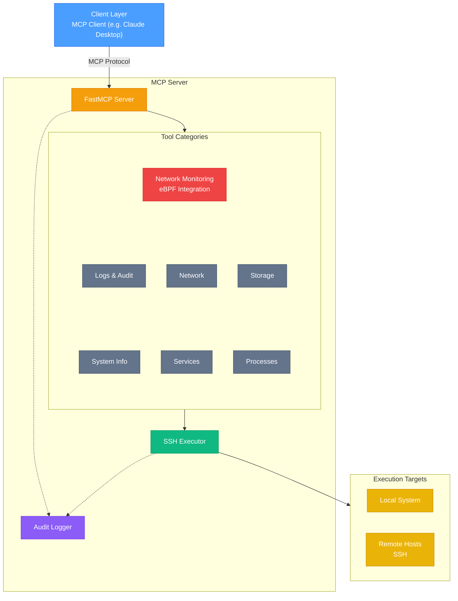

# Linux MCP Server

A Model Context Protocol (MCP) server for read-only Linux system administration, diagnostics, and troubleshooting on RHEL-based systems.

## Features

- **Read-Only Operations**: All tools are strictly read-only for safe diagnostics
- **Remote SSH Execution**: Execute commands on remote systems via SSH with key-based authentication
- **Multi-Host Management**: Connect to different remote hosts in the same session
- **Comprehensive Diagnostics**: System info, services, processes, logs, network, and storage
- **Configurable Log Access**: Control which log files can be accessed via environment variables
- **RHEL/systemd Focused**: Optimized for Red Hat Enterprise Linux systems

## Architecture Overview



### Key Components

- **FastMCP Server**: Core MCP protocol server handling tool registration and invocation
- **Tool Categories**: Six categories of read-only diagnostic tools (system info, services, processes, logs, network, storage)
- **SSH Executor**: Routes commands to local subprocess or remote SSH execution with connection pooling
- **Audit Logger**: Comprehensive logging in both human-readable and JSON formats with automatic rotation
- **Multi-Target Execution**: Single server instance can execute commands on local system or multiple remote hosts

## Available Tools

### System Information
- `get_system_info` - OS version, kernel, hostname, uptime
- `get_cpu_info` - CPU details and load averages
- `get_memory_info` - RAM usage and swap details
- `get_disk_usage` - Filesystem usage and mount points
- `get_hardware_info` - Hardware details (CPU architecture, PCI/USB devices, memory hardware)

### Service Management
- `list_services` - List all systemd services with status
- `get_service_status` - Detailed status of a specific service
- `get_service_logs` - Recent logs for a specific service

### Process Management
- `list_processes` - Running processes with CPU/memory usage
- `get_process_info` - Detailed information about a specific process

### Logs & Audit
- `get_journal_logs` - Query systemd journal with filters
- `get_audit_logs` - Read audit logs (if available)
- `read_log_file` - Read specific log file (whitelist-controlled)

### Network Diagnostics
- `get_network_interfaces` - Network interface information
- `get_network_connections` - Active network connections
- `get_listening_ports` - Ports listening on the system

### Network Monitoring (eBPF Integration)
- `get_network_events_history` - Retrieve network events from eBPF collector logs with filtering
- `detect_network_anomalies` - Analyze events and detect suspicious patterns (port scanning, backdoors, etc.)
- `analyze_process_network_behavior` - Deep dive into specific process network activity with risk classification
- `get_network_event_stats` - Summary statistics about network activity with timelines

**Requirements**: These tools require the eBPF network monitoring agent to be deployed on the target system. See `deploy/ebpf-agent/README.md` for installation instructions.

### Storage & Disk Analysis
- `list_block_devices` - Block devices and partitions
- `list_directories_by_size` - List directories sorted by size (largest first) with top N limit
- `list_directories_by_name` - List all directories sorted alphabetically (A-Z or Z-A)
- `list_directories_by_modified_date` - List all directories sorted by modification date (newest/oldest first)

## Installation

### Prerequisites
- Python 3.10 or higher
- [uv](https://github.com/astral-sh/uv) package manager

### Setup

1. Clone the repository:
```bash
git clone <repository-url>
cd linux-mcp-server
```

2. Create virtual environment and install dependencies:
```bash
uv venv
source .venv/bin/activate
uv pip install -e ".[dev]"
```

## Configuration

Configure the server using environment variables:

```bash
# Comma-separated list of allowed log file paths
export LINUX_MCP_ALLOWED_LOG_PATHS="/var/log/messages,/var/log/secure,/var/log/audit/audit.log"

# Optional: Set log level (DEBUG, INFO, WARNING, ERROR, CRITICAL)
export LINUX_MCP_LOG_LEVEL="INFO"

# Optional: Custom log directory (default: ~/.local/share/linux-mcp-server/logs/)
export LINUX_MCP_LOG_DIR="/var/log/linux-mcp-server"

# Optional: Log retention in days (default: 10)
export LINUX_MCP_LOG_RETENTION_DAYS="30"

# Optional: Specify SSH private key path (defaults to ~/.ssh/id_ed25519, ~/.ssh/id_rsa, etc.)
export LINUX_MCP_SSH_KEY_PATH="/path/to/your/private/key"
```

### Audit Logging

The server includes comprehensive audit logging for all operations:

**Features:**
- **Dual Format**: Logs written in both human-readable text and JSON formats
- **Daily Rotation**: Automatic log rotation at midnight
- **Configurable Retention**: Keep logs for a specified number of days (default: 10)
- **Tiered Verbosity**: INFO for operations, DEBUG for detailed diagnostics
- **Sanitization**: Automatic redaction of sensitive data (passwords, tokens, API keys)

**Log Files:**
- Human-readable: `~/.local/share/linux-mcp-server/logs/server.log`
- JSON format: `~/.local/share/linux-mcp-server/logs/server.json`
- Rotated files: `server.log.YYYY-MM-DD` and `server.json.YYYY-MM-DD`

**What Gets Logged:**
- Server startup and shutdown
- All tool invocations with parameters (sanitized)
- Tool execution time and completion status
- SSH connections (success/failure)
- Remote command execution
- Error conditions with full context

**Log Levels:**
- `DEBUG`: Detailed flow, connection reuse, function entry/exit, timing details
- `INFO`: Tool calls, command executions, connection events, operation results
- `WARNING`: Authentication failures, retryable errors, missing optional data
- `ERROR`: Failed operations, exceptions, connection failures
- `CRITICAL`: Server startup/shutdown failures, unrecoverable errors

**Example Log Entries:**

```
# Human-readable format (server.log)
2025-10-10 14:23:45.123 | INFO | server | TOOL_CALL: list_services | host=server1.example.com | username=admin | execution_mode=remote
2025-10-10 14:23:45.234 | INFO | ssh_executor | SSH_CONNECT: admin@server1.example.com | status=success
2025-10-10 14:23:45.345 | INFO | ssh_executor | REMOTE_EXEC: systemctl list-units --type=service | host=server1.example.com | exit_code=0
2025-10-10 14:23:45.456 | INFO | server | TOOL_COMPLETE: list_services | status=success | duration=0.333s

# JSON format (server.json)
{"timestamp": "2025-10-10T14:23:45.123Z", "level": "INFO", "logger": "server", "message": "TOOL_CALL: list_services", "event": "TOOL_CALL", "tool": "list_services", "host": "server1.example.com", "username": "admin", "execution_mode": "remote"}
```

### Remote SSH Execution

All tools support optional `host` and `username` parameters for remote execution via SSH:

- **Authentication**: SSH key-based authentication only (no password support)
- **Key Discovery**: Automatically discovers SSH keys from `~/.ssh/` or use `LINUX_MCP_SSH_KEY_PATH`
- **Connection Pooling**: Reuses SSH connections for efficiency
- **Multi-Host**: Each tool call can target a different remote host

**Requirements**:
- SSH key-based authentication must be configured on remote hosts
- Remote user must have appropriate permissions for diagnostic commands

**Example Usage**:
```python
# Local execution
await list_services()

# Remote execution
await list_services(host="server1.example.com", username="admin")

# Different host in same session
await get_service_status("nginx", host="server2.example.com", username="sysadmin")
```

## Usage

### Running the Server

You can run the server in multiple ways:

**Using uv run (recommended for development):**
```bash
uv run linux-mcp-server
```

**Using uvx (recommended for one-off execution without installation):**
```bash
uvx --from /path/to/linux-mcp-server linux-mcp-server
```

**Traditional Python module execution:**
```bash
python -m linux_mcp_server
```

### Using with Claude Desktop

Add to your Claude Desktop configuration (`~/Library/Application Support/Claude/claude_desktop_config.json` on macOS):

**Option 1: Using uv run (simpler):**
```json
{
  "mcpServers": {
    "linux-diagnostics": {
      "command": "uv",
      "args": [
        "--directory",
        "/path/to/linux-mcp-server",
        "run",
        "linux-mcp-server"
      ],
      "env": {
        "LINUX_MCP_ALLOWED_LOG_PATHS": "/var/log/messages,/var/log/secure,/var/log/audit/audit.log"
      }
    }
  }
}
```

**Option 2: Using uvx (from local directory):**
```json
{
  "mcpServers": {
    "linux-diagnostics": {
      "command": "uvx",
      "args": [
        "--from",
        "/path/to/linux-mcp-server",
        "linux-mcp-server"
      ],
      "env": {
        "LINUX_MCP_ALLOWED_LOG_PATHS": "/var/log/messages,/var/log/secure,/var/log/audit/audit.log"
      }
    }
  }
}
```

### Using with OpenShift

Deploy the Linux MCP Server to OpenShift for enterprise environments with streamable-HTTP transport, enabling remote diagnostics of RHEL instances via a centralized MCP server.

#### Features

- ✅ **Streamable-HTTP Transport**: RESTful MCP protocol over HTTPS
- ✅ **Multi-Host Management**: Configure multiple RHEL instances via YAML
- ✅ **Secure SSH Key Management**: Kubernetes Secrets for SSH authentication
- ✅ **Persistent Logging**: PVC-backed log storage with rotation
- ✅ **Production Security**: Non-root user, read-only filesystem, minimal privileges
- ✅ **Auto-scaling Ready**: Kubernetes health probes and rolling updates
- ✅ **Automated CI/CD**: GitHub Actions builds and pushes to GHCR

#### Prerequisites

- OpenShift cluster access (`oc` CLI configured)
- SSH key for connecting to RHEL instances
- GitHub account (for automated image builds)

#### Quick Start

**1. Test Locally with Podman**

Before deploying to OpenShift, test the container locally:

```bash
# Build the image
podman build -t linux-mcp-server:test .

# Create a test configuration
cat > test-hosts.yaml <<EOF
hosts:
  - name: "my-rhel-server"
    host: "rhel.example.com"
    username: "admin"
    ssh_key_path: "/app/ssh-keys/id_rsa"
ssh_config:
  default_key_path: "/app/ssh-keys/id_rsa"
allowed_log_paths:
  - "/var/log/messages"
  - "/var/log/secure"
EOF

# Run the container
podman run -d --name mcp-test \
  -p 8000:8000 \
  -e LINUX_MCP_SSH_KEY_PATH=/app/ssh-keys/id_rsa \
  -v ./test-hosts.yaml:/app/config/hosts.yaml:ro \
  -v ~/.ssh/id_rsa:/app/ssh-keys/id_rsa:ro \
  linux-mcp-server:test

# Test the server
curl -X POST http://localhost:8000/mcp \
  -H "Content-Type: application/json" \
  -H "Accept: application/json, text/event-stream" \
  -d '{"jsonrpc": "2.0", "method": "initialize", "params": {"protocolVersion": "2024-11-05", "capabilities": {}, "clientInfo": {"name": "test", "version": "1.0"}}, "id": 1}'

# Clean up
podman stop mcp-test && podman rm mcp-test
```

**2. Push Code and Build Image**

The repository includes GitHub Actions that automatically builds and pushes the image to GitHub Container Registry (GHCR):

```bash
# Push to your feature branch
git push origin feature/openshift-deployment

# GitHub Actions will:
# - Build the container image
# - Push to ghcr.io/<your-username>/linux-mcp-server:latest
# - Tag with commit SHA
```

**Note:** Make the GHCR package public (one-time):
1. Go to: `https://github.com/<your-username>/linux-mcp-server/pkgs/container/linux-mcp-server/settings`
2. Change visibility to **Public**

**3. Deploy to OpenShift**

Use the deployment script or manual steps:

```bash
# Using the deployment script
./deploy/openshift/deploy.sh

# OR manually:
# Create namespace (if needed)
oc create namespace rhel-mcp

# Create SSH secret
oc create secret generic linux-mcp-ssh-keys \
  --from-file=id_rsa=~/.ssh/id_rsa \
  --namespace=rhel-mcp

# Configure your RHEL hosts in openshift/configmap.yaml
# Then apply all manifests
oc apply -f openshift/

# Wait for deployment
oc rollout status deployment/linux-mcp-server -n rhel-mcp
```

**4. Configure RHEL Hosts**

Edit `openshift/configmap.yaml` to add your RHEL instances:

```yaml
hosts:
  - name: "rhel-bastion"
    host: "bastion.example.com"
    username: "student"
    description: "RHEL 9.3 bastion host"
    ssh_key_path: "/app/ssh-keys/id_rsa"
    tags:
      - production
      - rhel9
```

Apply the updated configuration:
```bash
oc apply -f openshift/configmap.yaml
oc rollout restart deployment/linux-mcp-server -n rhel-mcp
```

#### Testing the Deployment

**Get the Route URL:**
```bash
ROUTE=$(oc get route linux-mcp-server -n rhel-mcp -o jsonpath='{.spec.host}')
echo "MCP Server: https://$ROUTE"
```

**Test 1: Initialize MCP Session**
```bash
curl -s -i -X POST "https://$ROUTE/mcp" \
  -H "Content-Type: application/json" \
  -H "Accept: application/json, text/event-stream" \
  -d '{"jsonrpc": "2.0", "method": "initialize", "params": {"protocolVersion": "2024-11-05", "capabilities": {}, "clientInfo": {"name": "test-client", "version": "1.0"}}, "id": 1}'
```

Expected response includes `mcp-session-id` header and:
```
event: message
data: {"jsonrpc":"2.0","id":1,"result":{"protocolVersion":"2024-11-05"...}}
```

**Test 2: Call Diagnostic Tools**

Get system information from a RHEL instance:
```bash
# Extract session ID from previous response
SESSION_ID="<your-session-id>"

# Get system info
curl -s -X POST "https://$ROUTE/mcp" \
  -H "Content-Type: application/json" \
  -H "Accept: application/json, text/event-stream" \
  -H "mcp-session-id: $SESSION_ID" \
  -d '{"jsonrpc": "2.0", "method": "tools/call", "params": {"name": "get_system_info", "arguments": {"host": "rhel.example.com", "username": "admin"}}, "id": 2}' \
  | grep "data:" | sed 's/data: //' | jq -r '.result.content[0].text'
```

Expected output:
```
Hostname: rhel-server.internal
Operating System: Red Hat Enterprise Linux 9.3 (Plow)
OS Version: 9.3
Kernel Version: 5.14.0-362.18.1.el9_3.x86_64
Architecture: x86_64
Uptime: up 1 hour, 17 minutes
```

**Test 3: List Services**
```bash
curl -s -X POST "https://$ROUTE/mcp" \
  -H "Content-Type: application/json" \
  -H "Accept: application/json, text/event-stream" \
  -H "mcp-session-id: $SESSION_ID" \
  -d '{"jsonrpc": "2.0", "method": "tools/call", "params": {"name": "list_services", "arguments": {"host": "rhel.example.com", "username": "admin"}}, "id": 3}' \
  | grep "data:" | sed 's/data: //' | jq -r '.result.content[0].text' | head -20
```

#### Monitoring and Troubleshooting

**Check Deployment Status:**
```bash
oc get pods -n rhel-mcp
oc get deployment linux-mcp-server -n rhel-mcp
oc get route linux-mcp-server -n rhel-mcp
```

**View Logs:**
```bash
# Tail logs in real-time
oc logs -f deployment/linux-mcp-server -n rhel-mcp

# View recent logs
oc logs deployment/linux-mcp-server -n rhel-mcp --tail=50
```

**Debug SSH Connection Issues:**
```bash
# Exec into the pod
oc exec -it deployment/linux-mcp-server -n rhel-mcp -- /bin/bash

# Check SSH key
ls -la /app/ssh-keys/

# Test SSH connection manually
ssh -i /app/ssh-keys/id_rsa user@rhel-host.example.com
```

**Common Issues:**

| Issue | Solution |
|-------|----------|
| Pod stuck in `CrashLoopBackOff` | Check logs with `oc logs`. Verify SSH key is mounted correctly. |
| `Multi-Attach error` | Deployment uses `Recreate` strategy. Delete old pods if stuck. |
| `Authentication failed` | Verify SSH key is added to RHEL host: `ssh-copy-id -i ~/.ssh/id_rsa.pub user@host` |
| `404 Not Found` on route | Check route exists: `oc get route -n rhel-mcp`. Verify pod is ready. |
| Health check failures | Deployment uses TCP probes on port 8000. Check pod is listening. |

#### Architecture on OpenShift

```
┌─────────────────────────────────────────────────────────┐
│ OpenShift Route (HTTPS)                                 │
│ https://linux-mcp-server-rhel-mcp.apps...              │
└────────────────────┬────────────────────────────────────┘
                     │
┌────────────────────▼────────────────────────────────────┐
│ Service (ClusterIP)                                     │
│ Port: 8000                                              │
└────────────────────┬────────────────────────────────────┘
                     │
┌────────────────────▼────────────────────────────────────┐
│ Deployment (1 replica, Recreate strategy)              │
│  ┌──────────────────────────────────────────────────┐  │
│  │ Pod: linux-mcp-server                            │  │
│  │ - Image: ghcr.io/.../linux-mcp-server:latest    │  │
│  │ - Non-root (OpenShift assigned UID)             │  │
│  │ - Read-only root filesystem                     │  │
│  │                                                  │  │
│  │ Volumes:                                         │  │
│  │ - ConfigMap: hosts.yaml (RHEL instances)        │  │
│  │ - Secret: SSH private keys                      │  │
│  │ - PVC: logs (persistent storage)                │  │
│  │ - EmptyDir: /tmp (writable temp)                │  │
│  └──────────────────┬───────────────────────────────┘  │
└─────────────────────┼──────────────────────────────────┘
                      │
        ┌─────────────┴─────────────┐
        │                           │
┌───────▼────────┐          ┌──────▼───────┐
│ RHEL Instance 1│          │RHEL Instance 2│
│ SSH Port 22    │          │SSH Port 22    │
└────────────────┘          └───────────────┘
```

**How It Works:**
1. **Client connects** to OpenShift Route (HTTPS with TLS termination)
2. **MCP Server Pod** receives requests via Streamable HTTP/SSE transport
3. **ConfigMap** provides RHEL hosts configuration (hostnames, usernames, SSH key paths)
4. **Secret** contains SSH private keys mounted read-only at `/app/ssh-keys/`
5. **MCP Server establishes SSH connections** to RHEL instances using the configured keys
6. **Commands execute** on RHEL systems and results stream back to the client

**Documentation:** See [docs/OPENSHIFT.md](docs/OPENSHIFT.md) for complete deployment guide, SSH configuration details, and advanced configuration.

#### Visual Testing with MCP Inspector

Deploy the [MCP Inspector](https://github.com/modelcontextprotocol/inspector) alongside the Linux MCP Server for visual testing and debugging:

```bash
# Deploy MCP Inspector
oc apply -f deploy/openshift/inspector/

# Get Inspector URL
oc get route mcp-inspector -n rhel-mcp -o jsonpath='{.spec.host}'
```

**Access the Inspector UI:**
1. Open the Inspector URL in your browser
2. Click **"Configuration"** and set **MCP_PROXY_FULL_ADDRESS** to the proxy route URL
3. Configure connection:
   - Transport: **"Streamable HTTP"**
   - Connection Type: **"Via Proxy"**
   - URL: `http://linux-mcp-server:8000/mcp`
4. Click **"Connect"** and start testing!

**Documentation:** See [docs/MCP_INSPECTOR.md](docs/MCP_INSPECTOR.md) for complete setup and usage guide.

## Development

### Running Tests

```bash
pytest
```

### Running Tests with Coverage

```bash
pytest --cov=src --cov-report=html
```

## Security Considerations

- All operations are **read-only**
- Log file access is controlled via whitelist (`LINUX_MCP_ALLOWED_LOG_PATHS`)
- **SSH key-based authentication only** - no password support
- SSH host key verification is disabled for flexibility (use with caution)
- No arbitrary command execution
- Input validation on all parameters
- Requires appropriate system permissions for diagnostics
- Remote user needs proper sudo/permissions for privileged commands
